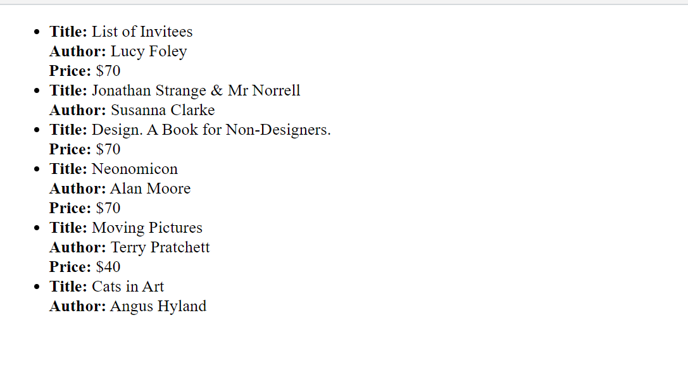
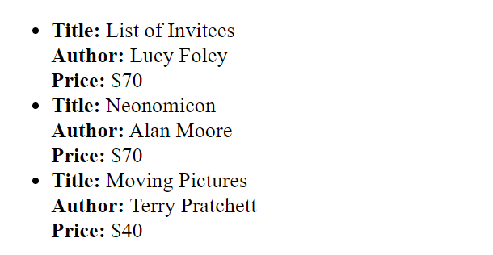

Hello, I show you how I completed Homework2 for Full Stack Advanced Course.

Requirements of task and how I handle them

1.Provide a few examples of when it is appropriate to use the try...catch construct in code.

The try...catch construct is useful for handling and managing errors in your code

1)Below one is used for File System
```javascript
try {
  fs.accessSync(path);
} catch (err) {
  console.error(err);
}
```

2)This one also belongs to File System which does job of sync.
```javascript
try {
  fs.statSync(name);
} catch (err) {
  return 'ENOENT' == err.code ? null : err;
}

```

3)This try,catch block is used for parsing JSON file.
```javascript
try {
  return JSON.parse(content);
} catch (e) {
  if (options && options.onError) {
    options.onError(e);
  }
  return undefined;
}

```

4)Finally, this try,catch block belongs to Date class of JS.
```javascript
try {
  return new Date(value);
} catch (e) {
  warnOnce(e);   //predefined method
  return new Date(value);
}
```


2. TASK to implement try,catch block of execution code to handle errors efficiently and simply.

Let's meet with requirements of this task.

1)Display this array as a list on the screen "(using the <ul> tag - the list should be generated using JavaScript)." 
2)There should be a div on the page with id="root", where this list should be added (similar to the task performed in the basic module).

Below code explain above 2 requirements of task.

```javascript
const rootElement = document.getElementById("root");
const ulElement = document.createElement("ul");

books.forEach(book => {
  const liElement = document.createElement("li");

  let content = `<strong>Title:</strong> ${book.name}`;
  if (book.author) {
    content += `<br><strong>Author:</strong> ${book.author}`;
  }
  if (book.price) {
    content += `<br><strong>Price:</strong> $${book.price}`;
  }

  liElement.innerHTML = content;

  ulElement.appendChild(liElement);
});

rootElement.appendChild(ulElement);
```

Output is like below=>


However, task requirements are different for us , that's why we need to change something from code.

3)Before adding an object to the page, it should be checked for correctness (the object should contain all three properties - author, name, price). If any of these properties are missing, an error should be displayed in the console indicating which property is missing in the object.
4)Array elements that do not meet the conditions mentioned above should not appear on the page.


Let's see our final code. 

Reminder! Also we update code with today's topic try and catch block of code.
```javascript
const rootElement = document.getElementById("root");
const ulElement = document.createElement("ul");

books.forEach(book => {
  try {
    if (!book.author || !book.name || !book.price) {
      throw new Error("Invalid book object");
    }

    const liElement = document.createElement("li");

    let content = `<strong>Title:</strong> ${book.name}<br>`;
    content += `<strong>Author:</strong> ${book.author}<br>`;
    content += `<strong>Price:</strong> $${book.price}`;

    liElement.innerHTML = content;
    ulElement.appendChild(liElement);
  } catch (error) {
    console.error(`${error.message}: ${JSON.stringify(book)}`);
  }
});

rootElement.appendChild(ulElement);
```

Finally, our homework is ready to show you. Let's look at the result of this task together.
