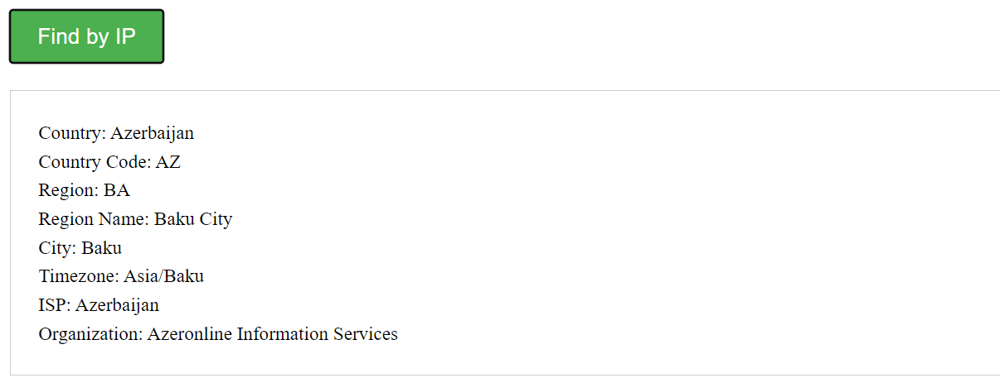

Hello, I show you how I completed Homework6 for Full Stack Advanced Course.

Requirements of task and how I handle them

1.Theoretical Question
Explain in your own words how you understand the concept of asynchronous programming in JavaScript.=>
Asynchronous programming in JavaScript refers to the ability to perform tasks or operations without blocking the execution of other code. It allows for concurrent or parallel execution of multiple tasks, improving the overall efficiency and responsiveness of a program.

In simple words, imagine you have two tasks to complete: Task A and Task B. With synchronous programming, you would need to finish Task A before moving on to Task B. This means if Task A takes a long time to complete, Task B would be delayed.

But in asynchronous programming, you will get this=>
However, with asynchronous programming, you can start Task A and Task B simultaneously. While Task A is being processed, the program doesn't wait for it to finish and can immediately move on to execute Task B. This allows the program to make progress on multiple tasks concurrently.


2.Practical Part=> Write a program called "Find You by IP".

Requirements of task=>
1.Create a simple HTML page with a button labeled Find by IP.
```html
<!DOCTYPE html>
<html>
<head>
  <title>Find You by IP</title>
</head>
<body>
  <button id="findButton">Find by IP</button>
  <div id="result"></div>

  <script src="main.js"></script>
</body>
</html>

```
2.Upon clicking the button, send an AJAX request to the address https://api.ipify.org/?format=json to retrieve the client's IP address.
```javascript
async function fetchIpAddress(){
  try{
    const response=await fetch('https://api.ipify.org/?format=json');
    const data=await response.json();
    return data.ip;
  }
  catch(error){
    console.log(`Error happened while fetching IP Address=>${error}`);
  }
}
```

3.Once the IP address is obtained, send a request to the service https://ip-api.com/ to fetch information about the physical address.
```javascript
async function fetchinfo(ipaddress){
  try{
    const response=await fetch(`http://ip-api.com/json/${ipaddress}`);
    const data=await response.json();
    return data;
  }
  catch(error){
    console.log(`Error happened while fetching info=>${error}`);
  }
}
```

4.Display the information received from the last request below the button, including the continent, country, region, city, and district.
```javascript
async function handleClick(){
  const ipaddress=await fetchIpAddress();
  const info=await fetchinfo(ipaddress);

  try{
      resultdiv.innerHTML = `
      <p>Country: ${info.country}</p>
      <p>Country Code: ${info.countryCode}</p>
      <p>Region: ${info.region}</p>
      <p>Region Name: ${info.regionName}</p>
      <p>City: ${info.city}</p>
      <p>Timezone: ${info.timezone}</p>
      <p>ISP: ${info.country}</p>
      <p>Organization: ${info.org}</p>
    `;
  }
  catch(error){
    console.log(`Error happened while showing results=>${error}`);
  }

}
```

**Optional** Task for me=> I also added some styling to make small application as usable!

Finally=> As some results gives undefined message to me, that's why I change a little bit content of coming data from api.
So that, it should be in order like this **country,countryCode,region,regionName,city,timezone,isp,org** as you see on image below.



